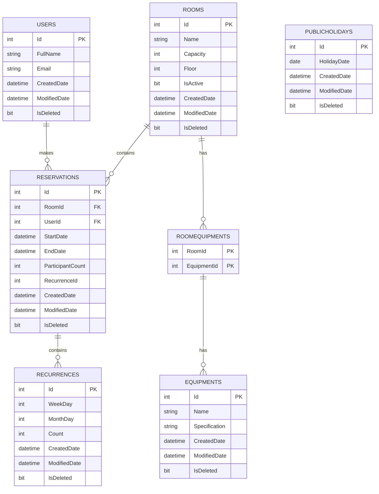

# MeetingRoomReservation

## Toplantı Odası Rezervasyon Sistemi (Hitsoft .NET Core Developer Case Çalışması)

## 1-Projeyi çalıştırma adımları
 a) https://github.com/oguzhanturkmen2/MeetingRoomReservation Github reposundan kodlar indirilir.
 
 b) Sql Server DB sinde MEETING isminde bir database create edilir. İçi boş olmalı. 
 
 c) VS 2022 veya 2026 ile solution açılır. 
 
 d) appsettings.json dosyasındaki default connection değerindeki Server, User Id ve Password kısımları mevcut SQL Server bağlantı bilgileri ile değiştirilir.
  "DefaultConnection": "Server=.\\SQLEXPRESS;Database=MEETING;User Id=user_MEETING;Password=Aa12345678**;TrustServerCertificate=True;MultipleActiveResultSets=True"
  
 e) Proje VS 2022 ile debug modda çalıştırılır. Tüm tablolar ve seed kayıtları otomatik oluşacaktır.
 
 f) Proje https://localhost:7134/swagger/index.html adresiyle çalışacaktır. Swagger ile veya Postman ile test edilebilir.
 
 g) Postman test collection:  https://www.postman.com/oguzhanturkmen/meetingreservation/collection/21031864-931e09cc-427b-4c41-9593-65a1c40119e9?action=share&source=copy-link&creator=21031864

## 2-İş kuralları

&nbsp; a) Çakışan toplantı rezevasyonu yapılamaz. Bu şekilde olursa karmaşıklık olur.

&nbsp; b) Minumum rezervasyon  aralığı 30 dakika. Makul bir süre.

&nbsp; c) Maksimum rezervasyon  aralığı 4 saat. En fazla yarım gün toplantı olabilir. Sonrasında yemek arası veya iş çıkışı olur.

&nbsp; d) Geçmişe bir rezervasyon yapılamaz. Böyle bir şey anlamsız olur.

&nbsp; e) En fazla 3 ay ilerisine rezervasyon yapılabilir. Makul bir süre.

&nbsp; f) Rezervasyon iptali 15 dakika öncesine kadar yapılabilir. Mantıklı bir süre.

&nbsp; g) Başlamış bir toplantı iptal edilemez. Zaten toplantı saati geçmiş. Başka rezervasyon alınamaz.

&nbsp; h) Katılımcı sayısı oda kapasitesini aşamaz. Aşarsa hata verir ve rezervasyon yapmaz.

&nbsp; i) Bir kullanıcı aynı anda sadece bir odayı rezerve edebilir. Kullanıcı aynı anda iki yerde bulunamaz.

&nbsp; f) Logger eklendi. DB Logs tablosunda tutulmaktadır.

## 3-Tekrarlayan toplantılar
  Tekrarlayan toplantılar için ayrı bir tabloda toplantı bilgileri saklanır. Ayrıca rezervasyon tablosunda her bir tekrar için kayıt oluşturulur ve Tekrar tablosundaki ID rezervasyon tablosuna yazılır. Tekrarlayan toplantı iptal edildiğinde hem tekrarlayan tablosu hem de rezervasyon tablosundaki veriler silinir. Rezervasyon tablosunda da kayıt tutulduğu için herhangi bir çakışma durumu kolaylıkla bulunabilir.

## 4-Veritabanı şeması

## 5-API endpointler

### 👤 Users
GET     /api/users  
GET     /api/users/{id}  
POST    /api/users  
PUT     /api/users/{id}  
DELETE  /api/users/{id}  

---

### 🏢 Rooms
GET     /api/rooms  
GET     /api/rooms/{id}  
POST    /api/rooms  
PUT     /api/rooms/{id}  
DELETE  /api/rooms/{id}  

---

### 🧰 Equipments
GET     /api/equipments  
GET     /api/equipments/{id}  
POST    /api/equipments  
PUT     /api/equipments/{id}  
DELETE  /api/equipments/{id}  

---

### 📅 Reservations
GET     /api/reservations  
GET     /api/reservations/{id}  
POST    /api/reservations  
PUT     /api/reservations/{id}  
DELETE  /api/reservations/{id}   
GET     /api/reservations/conflicts?roomId={id}&start;={datetime}&end;={datetime}

---

### 🎉 Public Holidays
GET     /api/publicholidays  
GET     /api/publicholidays/{id}  
POST    /api/publicholidays  
PUT     /api/publicholidays/{id}  
DELETE  /api/publicholidays/{id}  

